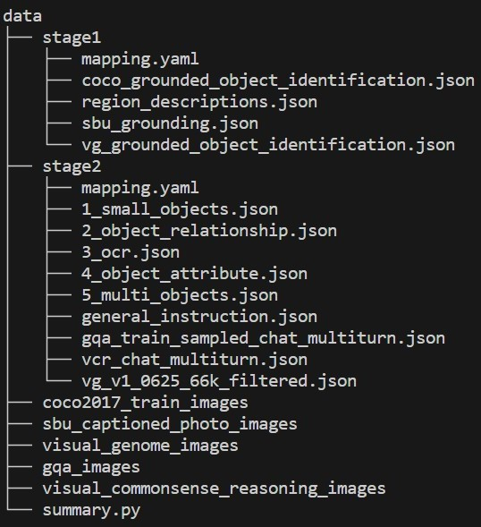

# Position-Enhanced Visual Instruction Tuning for Multimodal Large Language Models

*Extending the functionality of MLLMs by integrating an additional region-level vision encoder.*

[[Paper](https://arxiv.org/abs/2308.13437)]
[[Demo](https://huggingface.co/spaces/PVIT/pvit)]

[](https://github.com/tatsu-lab/stanford_alpaca/blob/main/LICENSE)
[](https://github.com/tatsu-lab/stanford_alpaca/blob/main/DATA_LICENSE)
**Usage and License Notices**: The data and checkpoint is intended and licensed for research use only. They are also restricted to uses that follow the license agreement of LLaMA, Vicuna and GPT-4. The dataset is CC BY NC 4.0 (allowing only non-commercial use) and models trained using the dataset should not be used outside of research purposes.


## Contents

- [Install](#install)
- [PVIT Weights](#pvit-weights)
- [Data Generation](#data-generation)
- [Demo](#Demo)
- [Data](#Data)
- [Train](#Train)
- [Evaluation](#Evaluation)

## Install

1. Clone this repository and navigate to PVIT folder

```Shell
git clone https://github.com/THUNLP-MT/PVIT.git 
cd PVIT
```

2. Install Package

```Shell
conda create -n pvit python=3.9.6
conda activate pvit
pip install -r requirements.txt
```

3. Install RegionCLIP

```Shell
git clone https://github.com/microsoft/RegionCLIP.git
pip install -e RegionCLIP
```

Click [here](https://github.com/microsoft/RegionCLIP) for more details.

## PVIT Weights

To get PVIT weights, please first download weights of [LLaMA](https://ai.meta.com/resources/models-and-libraries/llama-downloads) and [RegionCLIP](https://github.com/microsoft/RegionCLIP). For RegionCLIP, please download `regionclip_pretrained-cc_rn50x4.pth`. 

Click [here](https://huggingface.co/PVIT/pvit) for PVIT checkpoints. Please put all the weights in folder `model_weights` and merge PVIT weights with LLaMA weights through the following command.

```shell
BASE_MODEL=model_weights/llama-7b TARGET_MODEL=model_weights/pvit DELTA=model_weights/pvit-delta ./scripts/delta_apply.sh
```

## Data Generation

We provide prompts and few-shot examples used when querying ChatGPT in both task-specific instruction data generation and general instruction data generation (Figure 3 (b) and Figure 3 (c) in our [paper](https://arxiv.org/abs/2308.13437)).

The `data_generation/task-specific` folder includes seeds, prompts and examples in single-turn conversation generation and multi-turn conversation generation. Single-turn conversation generation includes five types of tasks: small object recognition, object relationship-based reasoning, optical character recognition (OCR), object attribute-based reasoning, and same-category object discrimination, 

The `data_generation/general` folder includes seeds, prompts and examples used in general instruction data generation.

## Demo

To run our demo, you need to prepare PVIT checkpoints locally. Please follow the instructions [here](#pvit-weights) to download and merge the checkpoints.

### Web Server

To run the demo, please first launch a web server with the following command.

```Shell
MODEL_PATH=model_weights/pvit CONTROLLER_PORT=39996 WORKER_PORT=40004 ./scripts/model_up.sh
```

### Streamlit Web UI

Run the following command to run a Streamlit demo locally. The port of `MODEL_ADDR` should be consistant with `WORKER_PORT`.

```Shell
MODEL_ADDR=http://0.0.0.0:40004 ./scripts/run_demo.sh
```

### CLI Inference

Run the following command to do cli inference locally. The port of `MODEL_ADDR` should be consistant with `WORKER_PORT`.

```Shell
MODEL_ADDR=http://0.0.0.0:40004 ./scripts/run_cli.sh
```

## Data

You can download [stage1](https://huggingface.co/datasets/PVIT/pvit_data_stage1) and [stage2](https://huggingface.co/datasets/PVIT/pvit_data_stage2) training data on huggingface. You are required to download pictures of [COCO2017 Train](https://cocodataset.org/), [SBU Captioned Photo](https://www.cs.rice.edu/~vo9/sbucaptions/), [Visual Genome](https://homes.cs.washington.edu/~ranjay/visualgenome/), [GQA](https://cs.stanford.edu/people/dorarad/gqa/) and [Visual Commonsense Reasoning](http://visualcommonsense.com/) datasets as well. Please put stage1 and stage2 data, and the downloaded pictures in folder `data` as follows. You can modify `image_paths` in `data/stage1/mapping.yaml` and `data/stage2/mapping.yaml` to change the path of downloaded pictures.



## Train

Our model is trained in two stages. In stage 1, we initialize the model with the pre-trained LLaVA, and only train the linear projection layer that is responsible for transforming the region features. In stage 2, we only keep the parameters of the image encoder and the region encoder frozen, and fine-tune the rest of the model.

To train PVIT, please download the [pretrained LLaVA checkpoints](https://github.com/haotian-liu/LLaVA), and put it in folder `model_weights`.

The following commands are for stage 1 training.

```Shell
export MODEL_PATH="model_weights/llava-lightning-7b-v1"
export REGION_CLIP_PATH="model_weights/regionclip_pretrained-cc_rn50x4.pth"
export DATA_PATH="data/stage1"
export OUTPUT_DIR="checkpoints/stage1_ckpt"
export PORT=25001
./scripts/train_stage1.sh
```

The following commands are for stage 2 training.

```Shell
export MODEL_PATH="checkpoints/stage1_ckpt"
export REGION_CLIP_PATH="model_weights/regionclip_pretrained-cc_rn50x4.pth"
export DATA_PATH="data/stage2"
export OUTPUT_DIR="checkpoints/stage2_ckpt"
export PORT=25001
./scripts/train_stage2.sh
```

## Evaluation

We propose **FineEval** dataset for human evaluation. See folder `fine_eval` for the dataset and model outputs. The files in the folder are as follows.

- `images`: Image files of **FineEval** dataset.
- `instructions.jsonl`: Questions of **FineEval** dataset.
- `pvit.jsonl`: The results of PVIT (ours) model.
- `llava.jsonl`: The results of LLaVA model.
- `shikra.jsonl`: The results of Shikra model.
- `gpt4roi.jsonl`: The results of GPT4RoI model.

To run PVIT on **FineEval** dataset, you can launch a web server and run the following command. The port of `MODEL_ADDR` should be consistant with `WORKER_PORT`.

```Shell
MODEL_ADDR=http://0.0.0.0:40004 ./scripts/run_fine_eval.sh
```

## Citation

If you find PVIT useful for your research and applications, please cite using this BibTeX:
```bibtex
@misc{chen2023positionenhanced,
      title={Position-Enhanced Visual Instruction Tuning for Multimodal Large Language Models}, 
      author={Chi Chen and Ruoyu Qin and Fuwen Luo and Xiaoyue Mi and Peng Li and Maosong Sun and Yang Liu},
      year={2023},
      eprint={2308.13437},
      archivePrefix={arXiv},
      primaryClass={cs.CV}
}
```

## Acknowledgement

- [LLaVA](https://github.com/haotian-liu/LLaVA): the codebase we built upon, which has the amazing multi-modal capabilities!
- [Vicuna](https://github.com/lm-sys/FastChat): the codebase LLaVA built upon, and the base model Vicuna-13B that has the amazing language capabilities!
- [RegionCLIP](https://github.com/microsoft/RegionCLIP): Our prompt encoder.

## Related Projects

- [Instruction Tuning with GPT-4](https://github.com/Instruction-Tuning-with-GPT-4/GPT-4-LLM)
- [LLaVA: Large Language and Vision Assistant](https://github.com/haotian-liu/LLaVA)
- [LLaVA-Med: Training a Large Language-and-Vision Assistant for Biomedicine in One Day](https://github.com/microsoft/LLaVA-Med)
- [Otter: In-Context Multi-Modal Instruction Tuning](https://github.com/Luodian/Otter)
- [Shikra: Unleashing Multimodal LLM’s Referential Dialogue Magic](https://github.com/shikras/shikra)
- [GPT4RoI: Instruction Tuning Large Language Model on Region-of-Interest](https://github.com/jshilong/GPT4RoI)
